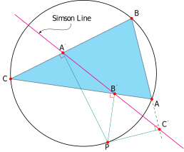

# Euclidea

## Introduction

Euclidea is a tikz library designed for enchancing tikz in Euclidean geometry drawings and provides the following interfaces:

* `affine={A,B,k}`: returns affine combination of two points, i.e. A + k * ( B - A ).
* `midpoint={A,B}`: returns midpoint of AB.
* `translate={A,B,C}`: returns translation of point C by the vector AB, i.e. C + ( B - A ).
* `reflect={A,B,C}`: reflects point C across line AB.
* `project={A,B,C}`: projects point C onto line AB.
* `inverse={O,A,P}`: returns the inverse point of point C with respect to circle(O,A).
* `revolve={A,B}`: rotates point B by the angle around point A.
* `angle bisector={A,B,C}`: alias for `[revolve/angle={A,B,C},revolve/scale=.5,revolve={A,B}]`.
* `erect={A,B}`: alias for `[revolve/angle=90,revolve={A,B}]`.
* `equilateral={A,B}`: alias for `[revolve/angle=60,revolve={A,B}]`.
* `intercept={A,B}`: intercepts a line segment (starting from point A) of a certain length on line AB.
* `intersect={A,B,C,D}`: returns the intersection of line AB and line CD. 
* `perpendicular bisector={A,B}`: creates the perpendicular bisector of segment AB.
* `perpendicular={A,B,C}`: creates a line through point C perpendicular to line AB.
* `parallel={A,B,C}`: creates a line through point C parallel to line AB.
* `circumcenter={A,B,C}`: returns the circumcenter of a triangle.
* `orthocenter={A,B,C}`: returns the orthocenter of a triangle.
* `incenter={A,B,C}`: returns the incenter of a triangle.
* `excenter={A,B,C}`: returns the excenter of a triangle.
* `nine-point center={A,B,C}`: returns the nine-point center of a triangle.
* `circle={O,A}`: creates a circle with the center (O) through point A.
* `tangent point={O,A,P}`: returns the tangent point of the tangent (to the left of vector OP) through point P to the circle {O,A}.
* `external center={O1,A1,O2,A2}`: returns the external homothetic center of two circles.
* `internal center={O1,A1,O2,A2}`: returns the internal homothetic center of two circles.
* `radical axis={O1,A1,O2,A2}`: creates the radical axis of two non-concentric circles.

## Example

Here is TikZ code for drawing Simson line.

```
\documentclass{standalone}
\usepackage{tikz}
\usetikzlibrary{euclidea,quotes,angles}

\begin{document}
\begin{tikzpicture}
  \coordinate (A) at (4,0);
  \coordinate (B) at (3,4);
  \coordinate (C) at (-3,1);
  \coordinate[circumcenter={A,B,C}] (O);
  % fetch fetch an arbitrary point on the circumcirle
  \coordinate[revolve/angle=-50,revolve={O,A}] (P);
  % perpendicular feet
  \coordinate (A') at ($(B)!(P)!(C)$);
  \coordinate (B') at ($(C)!(P)!(A)$);
  \coordinate (C') at ($(A)!(P)!(B)$);

  \draw[thick,fill=cyan,opacity=.45] (A) -- (B) -- (C) -- cycle;
  \draw[thick,circle={O,A}];
  % perpendicular lines
  \draw[teal,perpendicular={B,C,P}];
  \draw[teal,perpendicular={C,A,P}];
  \draw[teal,perpendicular={A,B,P}];
  \draw[thick,magenta,
    start modifier=-.5,end modifier=1.25,
    parallel={A',C',A'}];%simson line
  \draw (0,4) node (L) {Simson Line};
  \draw[->,>=latex] (L) to[out=-90,in=45] ($(A')!-.25!(C')$);
  
  \pic[draw,red,angle radius=2mm]{right angle= P--A'--C};
  \pic[draw,red,angle radius=2mm]{right angle= P--B'--C};
  \pic[draw,red,angle radius=2mm]{right angle= P--C'--A};
  \draw[dashed,end modifier=.5,parallel={B,A,A}];

  \foreach \p/\placement in {A/below right, B/above right,
  C/left, A'/above, B'/above, C'/above right, P/below}{
    \fill[red] (\p) circle (2pt);
    \draw (\p) node[\placement] {$\p$};
  }
\end{tikzpicture}
\end{document}
```

The result:



## License

Copyright (c) 2023 atlastze@gmail.com. All rights reserved.

Redistribution and use in source and binary forms are permitted provided that the above copyright notice and this paragraph are duplicated in all such forms and that any documentation, advertising materials, and other materials related to such distribution and use acknowledge that the software was developed by the atlastze@gmail.com. The name of the atlastze@gmail.com may not be used to endorse or promote products derived from this software without specific prior written permission. THIS SOFTWARE IS PROVIDED `'AS IS″ AND WITHOUT ANY EXPRESS OR IMPLIED WARRANTIES, INCLUDING, WITHOUT LIMITATION, THE IMPLIED WARRANTIES OF MERCHANTABILITY AND FITNESS FOR A PARTICULAR PURPOSE.